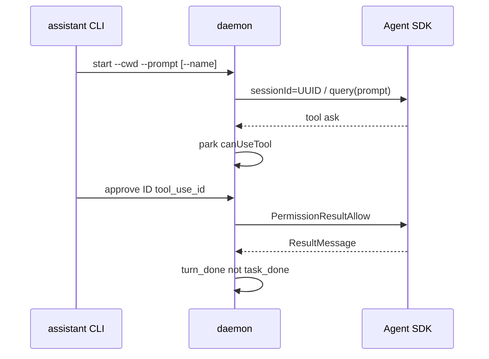

# ccop

内部控制面（internal Agent SDK host）。**给助手操作，不是给用户当面跑的产品。** 没有 TUI，没有像素，没有「打开 Claude Code 窗口」。命令行只吐一行 JSON。

助手用 JSON CLI 驱动常驻 daemon；daemon 持有活的 Agent SDK 客户端（ClaudeSDKClient / query），按 Claude session UUID 隔离，权限走 allow/ask/deny，事件写在 data/ 里供 Read。

    npx tsx src/cli.ts <cmd> ...
    npm start -- <cmd> ...
    npm run up

P1-P8 writeup: DESIGN.md (do not shorten). README keeps commands and JSON only.

## 1. 这是什么 / 不是什么

是：助手的控制面（JSON in / JSON out）；一个 Node 进程拥有多条 live session；unix socket RPC + data/sessions.json + data/events/<id>.jsonl；同一套引擎官方 @anthropic-ai/claude-agent-sdk（默认 settingSources: user+project+local，会读 ~/.claude）。

不是：用户产品、营销 CLI；每次 claude -p 再起一个一次性进程；tmux attach、交互键盘、TUI；另一套自研 agent。

P1 已接受的缺口：这个进程没有 claude --bg 那种 TUI attach。要看交互画面，只能另开 claude --bg，且不能和本 host 抢同一条 live session 的键盘。

## 2. 身份：id / title / name

三条东西不要混。P1-P8 的问题清单在 DESIGN.md。

- **id**：Claude session UUID。start 生成并作为 SDK options.sessionId。resume / --resume-id 用同一个 UUID。这是唯一主键。sdk_session_id 与 id 相同。
- **title**：Claude 自己的标题（SDKSessionInfo.customTitle / summary）。status 展示。不是 key。
- **name**：可选操作者标签（start --name / -n）。只是展示，可映射到 SDK title / renameSession。重复允许。不要当 key。永不因 name 已存在而拒绝 start。

若传入的不是 id、但唯一命中一条会话的 name 或 title，MAY 解析；2+ 条则 error=ambiguous name 并带回 ids。优先传 id。

## 3. 机制

    助手 CLI (JSON stdout)
            |  unix socket  data/ccop.sock
            v
       daemon (tsx src/cli.ts _serve)
            |  每个 Claude session UUID 一个 Session
            v
      ClaudeSDKClient / query()  -- canUseTool -- policy allow|ask|deny
            |                         |
            |                         + park Future 直到 approve/deny
            v
      classify -> data/events/<id>.jsonl
               -> data/sessions.json（按 id 索引）

一次 turn 的流向（散文）：

1. 助手 start --cwd DIR --prompt TEXT [--name LABEL] [--resume-id UUID]
2. daemon 生成或沿用 UUID，options.sessionId / resume 交给活客户端
3. 模型要跑 Write/Bash 等：policy=ask（或 hold 下的 allow）→ park canUseTool，写 needs_decision
4. 助手 status / events ID，看到 pending.tool_use_id
5. approve ID tool_use_id → PermissionResultAllow（deny 则 PermissionResultDeny）
6. 模型跑完该 turn，ResultMessage → turn_done（再 idle 或 failed）。这不是 task_done。

hold 时：send 立刻 {ok:false,error:"held"}；即使 Read 也会 park（reason=held）。

## 4. 命令参考

统一：成功/失败都是一行 JSON。ok:false 时退出码 1。

在 /workspace/ccop：

    npx tsx src/cli.ts up
    npx tsx src/cli.ts down
    npx tsx src/cli.ts start --cwd DIR --prompt TEXT [--name LABEL] [--resume-id UUID]
    npx tsx src/cli.ts send ID TEXT
    npx tsx src/cli.ts interrupt ID
    npx tsx src/cli.ts hold ID
    npx tsx src/cli.ts release ID
    npx tsx src/cli.ts stop ID
    npx tsx src/cli.ts approve ID tool_use_id
    npx tsx src/cli.ts deny ID tool_use_id
    npx tsx src/cli.ts status
    npx tsx src/cli.ts events ID [--tail N]
    npx tsx src/cli.ts info ID
    npx tsx src/cli.ts workflows ID
    npx tsx src/cli.ts tasks ID
    npx tsx src/cli.ts task-stop ID TASK_ID
    npx tsx src/cli.ts task-bg ID [tool_use_id]
    npx tsx src/cli.ts subagents ID

等价：npm start -- status ； npm run up。

例 up/down：

    {"ok": true, "pid": 1234, "already": false}
    {"ok": true, "pid": 1234, "already": true}
    {"ok": true}

例 start：

    {"ok": true, "id": "7c9e6679-7425-40de-944b-e07fc1f90ae7", "name": "smoke", "title": null, "sdk_session_id": "7c9e6679-7425-40de-944b-e07fc1f90ae7"}
    {"ok": false, "error": "session 7c9e6679-7425-40de-944b-e07fc1f90ae7 already live"}
    {"ok": false, "error": "connect failed: ..."}

例 send（含 hold）：

    {"ok": true, "id": "7c9e6679-7425-40de-944b-e07fc1f90ae7", "name": "smoke"}
    {"ok": false, "error": "held"}
    {"ok": false, "error": "session not live"}

例 误用重复 name（优先传 id）：

    {"ok": false, "error": "ambiguous name", "ids": ["7c9e6679-7425-40de-944b-e07fc1f90ae7", "11111111-1111-1111-1111-111111111111"]}

例 hold / release / interrupt / stop：

    {"ok": true, "id": "7c9e6679-7425-40de-944b-e07fc1f90ae7", "name": "smoke", "lock": "operator"}
    {"ok": true, "id": "7c9e6679-7425-40de-944b-e07fc1f90ae7", "name": "smoke", "lock": null}
    {"ok": true, "id": "7c9e6679-7425-40de-944b-e07fc1f90ae7"}

例 approve / deny：

    {"ok": true, "id": "7c9e6679-7425-40de-944b-e07fc1f90ae7", "name": "smoke", "tool_use_id": "toolu_...", "allowed": true}
    {"ok": false, "error": "no pending toolu_..."}

例 status（每行必有 cost_usd、token 合计、model_usage；历史会话可为 null）：

    {"ok": true, "sessions": [{"id": "7c9e6679-7425-40de-944b-e07fc1f90ae7", "name": "smoke", "title": "Create hello.py", "cwd": "/workspace/hello-cc", "alive": true, "lock": null, "sdk_session_id": "7c9e6679-7425-40de-944b-e07fc1f90ae7", "ultracode": true, "pending": [{"tool_use_id": "...", "tool": "Write", "reason": "ask"}], "last_turn": null, "last_task": null, "cost_usd": 0.12, "input_tokens": 150, "output_tokens": 28, "cache_read_input_tokens": 6, "cache_creation_input_tokens": 3, "model_usage": {"claude-opus": {"inputTokens": 100, "outputTokens": 20, "cacheReadInputTokens": 5, "cacheCreationInputTokens": 3, "costUSD": 0.1}}, "skills": ["pdf"], "slash_commands": ["/compact"], "plugins": []}]}

cost_usd 是 SDK 估算（ResultMessage.total_cost_usd，流式 query() 取最新一条，不要相加），不是 otomianai 账单。自定义 gateway 可能是 $0 或 Anthropic 标价。token 合计来自 modelUsage（主循环 + Task 子代理 + sidechain + compaction + Workflow），不是单轮 usage。

例 info / workflows：

    {"ok": true, "id": "7c9e6679-7425-40de-944b-e07fc1f90ae7", "ultracode": true, "skills": ["pdf"], "slash_commands": ["/compact"], "plugins": [], "usage": {"cost_usd": 0.12, "model_usage": {}, "last_turn_usage": {}, "updated_ts": 1770000000.1}, "cost_usd": 0.12, "input_tokens": 150, "output_tokens": 28, "cache_read_input_tokens": 6, "cache_creation_input_tokens": 3, "model_usage": {}}
    {"ok": true, "id": "7c9e6679-7425-40de-944b-e07fc1f90ae7", "skills": ["pdf"], "slash_commands": ["/compact"], "plugins": [], "note": "listed from session advertise (init); host does not invoke workflows — the model does"}

没有单独的 invoke-workflow RPC。settingSources 已是 user+project+local，磁盘上的 Claude Code dynamic workflows 由模型自己触发；host 只列出 session 广告过的 skills / slash_commands / plugins。

例 tasks / task-stop / task-bg / subagents：

    {"ok": true, "id": "7c9e6679-7425-40de-944b-e07fc1f90ae7", "tasks": [{"task_id": "t1", "tool_use_id": "toolu_...", "status": "running", "summary": "explore", "usage": {"total_tokens": 10}}]}
    {"ok": true, "id": "7c9e6679-7425-40de-944b-e07fc1f90ae7", "task_id": "t1"}
    {"ok": true, "id": "7c9e6679-7425-40de-944b-e07fc1f90ae7", "backgrounded": true, "tool_use_id": null}
    {"ok": true, "id": "7c9e6679-7425-40de-944b-e07fc1f90ae7", "source": "sdk", "subagents": ["agent-..."]}
    {"ok": false, "error": "stopTask is not available on this client (Python-shaped / no Query.stopTask)"}

例 events：

    {"ok": true, "id": "7c9e6679-7425-40de-944b-e07fc1f90ae7", "events": [{"ts": 1770000000.1, "id": "7c9e6679-7425-40de-944b-e07fc1f90ae7", "name": "smoke", "kind": "sent", "summary": "...", "extra": {}}, {"kind": "needs_decision", "summary": "can_use_tool parked Write"}, {"kind": "turn_done", "summary": "result message (turn, not task)"}]}

daemon 不可达：

    {"ok": false, "error": "daemon not reachable: ..."}

## 5. 明确没有解决的

- TUI attach / 像素 / tmux。要交互画面用 claude --bg，那是另一条进程。
- 和真人同时独占 --bg 键盘。不要对同一条 live --bg 会话再 send 或 -p --resume。
- 不是用户产品。不要写安装教程给终端用户。
- 不提交 data/ 里的 sock/pid/log/sessions/events，也不提交 secrets / ~/.claude。
- 没有 invoke-workflow RPC（模型自己触发）。没有从 ~/.claude/projects jsonl 回填用量当真相源。

## 6. TypeScript 之后怎么跑

要求 Node 20+。在 /workspace/ccop：

    npm install
    npm test
    npx tsx src/cli.ts up
    npx tsx src/cli.ts status
    npx tsx src/cli.ts start --cwd DIR --prompt TEXT [--name LABEL]
    npx tsx src/cli.ts events ID --tail 20
    npx tsx src/cli.ts down

可选：npx tsx scripts/check_sdk.ts ； npx tsx scripts/boot_check.ts ； npx tsx scripts/smoke.ts（smoke 会打真模型，需要本机已有 Claude 凭据）。

默认 settingSources 是 user + project + local，因此会读 ~/.claude，除非调用方改隔离。CLI 二进制默认 pathToClaudeCodeExecutable=/home/box/.local/bin/claude（与原先 Python 一致）；SDK 也自带平台 binary。

落盘路径不变：/workspace/ccop/data/ 。sessions.json 按 Claude session UUID 索引；事件文件是 data/events/<id>.jsonl。

## 7. 默认 ultracode

每条 session 的 query options 默认：

    ultracode: true
    enableWorkflows: true
    effort: "xhigh"

`ultracode` 是布尔 session flag（xhigh effort + 站立动态 workflow 编排），不是 EffortLevel。不要传 effort: "ultracode"。需要 enableWorkflows 和能跑 xhigh 的模型。用户 ~/.claude/settings.json 里的 ultracode / enableWorkflows / effortLevel 保持不动；host 仍在 start 时显式传入。

