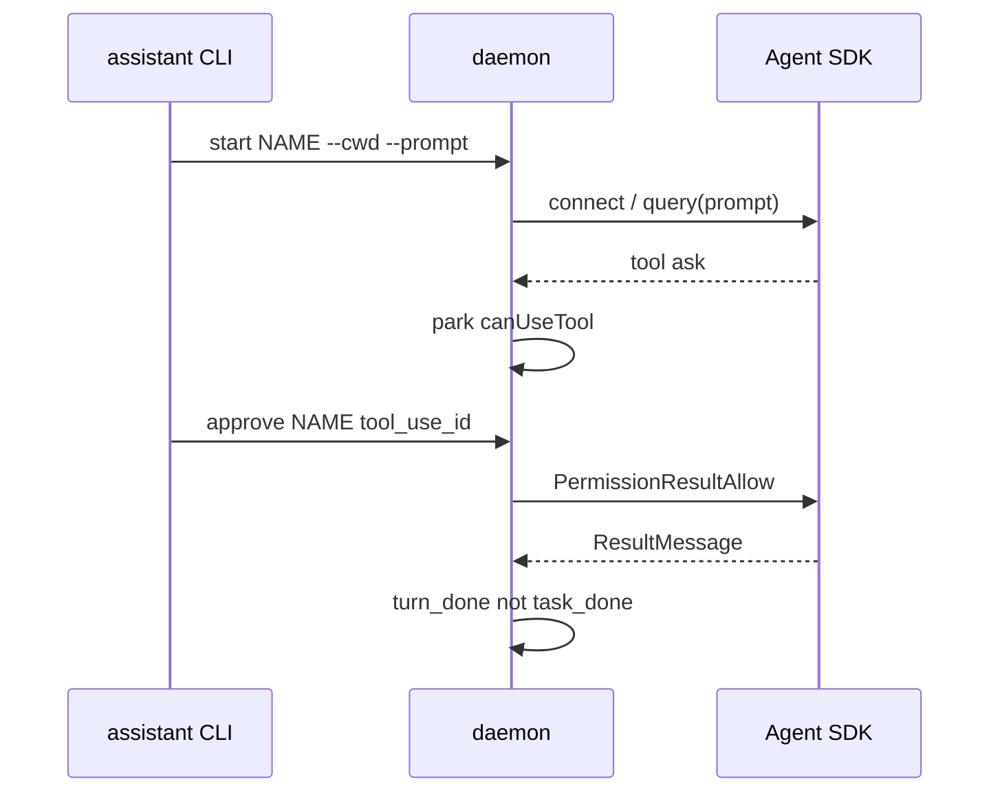

# ccop

内部控制面（internal Agent SDK host）。**给助手操作，不是给用户当面跑的产品。** 没有 TUI，没有像素，没有「打开 Claude Code 窗口」。命令行只吐一行 JSON。

助手用 JSON CLI 驱动常驻 daemon；daemon 持有活的 Agent SDK 客户端（ClaudeSDKClient / query），会话按名字隔离，权限走 allow/ask/deny，事件写在 data/ 里供 Read。

    npx tsx src/cli.ts <cmd> ...
    npm start -- <cmd> ...
    npm run up

## 1. 这是什么 / 不是什么

是：助手的控制面（JSON in / JSON out）；一个 Node 进程拥有多个 named live session；unix socket RPC + data/sessions.json + data/events/<name>.jsonl；同一套引擎官方 @anthropic-ai/claude-agent-sdk（默认 settingSources: user+project+local，会读 ~/.claude）。

不是：用户产品、营销 CLI；每次 claude -p 再起一个一次性进程；tmux attach、交互键盘、TUI；另一套自研 agent。

P1 已接受的缺口：这个进程没有 claude --bg 那种 TUI attach。要看交互画面，只能另开 claude --bg，且不能和本 host 抢同一条 live session 的键盘。

## 2. 为什么存在：早上的问题清单 P1-P8

早上的问题不是「再包一层 chatbot」，而是：怎样用程序管一条和 Claude Code 同引擎的活会话，而不撒谎、不抢键盘。

### P1 运行时拓扑

问题：TUI / --bg / -p / SDK 混用，谁拥有进程不清楚。
回答：本仓库的 programmatic host = Agent SDK（ClaudeSDKClient；TypeScript 侧也接受 query() 流式输入作为等价活客户端）。TUI attach 仍然只属于 claude --bg。本进程不提供 attach，这是明确接受的 gap。

### P2 事件总线

问题：「做完了 / 要你决定 / 要更多信息」混在 stdout 里。
回答：hook + canUseTool park 分类后写入 data/events/<name>.jsonl。needs_decision / needs_info / turn_done / task_done 分开。助手 Read 文件，不靠猜。

### P3 注入活会话

问题：对已经在跑的 --bg 再 claude -p --resume 会抢会话。
回答：send 只走本 daemon 持有的 live client 的 query()。绝不对一条正在 --bg 的会话做 -p --resume。没有 tmux，没有截像素。

### P4 控制锁

问题：助手和自动允许同时动手。
回答：hold 设 lock=operator：挡住 send，并且本来会 auto-allow 的工具也 park 等批准。release 清锁。

### P5 权限策略

问题：bypassPermissions 等于关掉门。
回答：permissionMode default + 自有 policy：Read/Grep/Glob allow；Write/Edit/Bash 等 ask；rm -rf /、sudo、往 /etc /usr 写 deny。ask/held 的调用按 tool_use_id approve/deny。

### P6 进度真话

问题：ResultMessage / Stop 被当成整个任务做完了。
回答：分类器把 Result 标成 turn_done only，不是 task_done。task_done 只来自 task notification status=completed。last_turn 和 last_task 在 sessions.json 里分开。

### P7 多会话隔离

问题：一条全局会话互相踩。
回答：按 name 隔离：各自 client、pending、event 文件、cwd。

### P8 生命周期

问题：进程死了会话号和事件一起没。
回答：up/down 管 daemon；sessions.json + events/ 落盘；start --resume-id 把 SDK session 接回来。

## 3. 机制

    助手 CLI (JSON stdout)
            |  unix socket  data/ccop.sock
            v
       daemon (tsx src/cli.ts _serve)
            |  每个 name 一个 Session
            v
      ClaudeSDKClient / query()  -- canUseTool -- policy allow|ask|deny
            |                         |
            |                         + park Future 直到 approve/deny
            v
      classify -> data/events/<name>.jsonl
               -> data/sessions.json

一次 turn 的流向（散文）：

1. 助手 start NAME --cwd DIR --prompt TEXT
2. daemon connect / 把 prompt 交给活客户端
3. 模型要跑 Write/Bash 等：policy=ask（或 hold 下的 allow）→ park canUseTool，写 needs_decision
4. 助手 status / events NAME，看到 pending.tool_use_id
5. approve NAME tool_use_id → PermissionResultAllow（deny 则 PermissionResultDeny）
6. 模型跑完该 turn，ResultMessage → turn_done（再 idle 或 failed）。这不是 task_done。

hold 时：send 立刻 {ok:false,error:"held"}；即使 Read 也会 park（reason=held）。

## 4. 命令参考

统一：成功/失败都是一行 JSON。ok:false 时退出码 1。

在 /workspace/ccop：

    npx tsx src/cli.ts up
    npx tsx src/cli.ts down
    npx tsx src/cli.ts start NAME --cwd DIR --prompt TEXT [--resume-id ID]
    npx tsx src/cli.ts send NAME TEXT
    npx tsx src/cli.ts interrupt NAME
    npx tsx src/cli.ts hold NAME
    npx tsx src/cli.ts release NAME
    npx tsx src/cli.ts stop NAME
    npx tsx src/cli.ts approve NAME tool_use_id
    npx tsx src/cli.ts deny NAME tool_use_id
    npx tsx src/cli.ts status
    npx tsx src/cli.ts events NAME [--tail N]

等价：npm start -- status ； npm run up。

例 up/down：

    {"ok": true, "pid": 1234, "already": false}
    {"ok": true, "pid": 1234, "already": true}
    {"ok": true}

例 start：

    {"ok": true, "name": "smoke", "sdk_session_id": "..."}
    {"ok": false, "error": "session smoke already live"}
    {"ok": false, "error": "connect failed: ..."}

例 send（含 hold）：

    {"ok": true, "name": "smoke"}
    {"ok": false, "error": "held"}
    {"ok": false, "error": "session not live"}

例 hold / release / interrupt / stop：

    {"ok": true, "name": "smoke", "lock": "operator"}
    {"ok": true, "name": "smoke", "lock": null}
    {"ok": true, "name": "smoke"}

例 approve / deny：

    {"ok": true, "name": "smoke", "tool_use_id": "toolu_...", "allowed": true}
    {"ok": false, "error": "no pending toolu_..."}

例 status：

    {"ok": true, "sessions": [{"name": "smoke", "cwd": "/workspace/hello-cc", "alive": true, "lock": null, "sdk_session_id": "...", "pending": [{"tool_use_id": "...", "tool": "Write", "reason": "ask"}], "last_turn": null, "last_task": null}]}

例 events：

    {"ok": true, "name": "smoke", "events": [{"ts": 1770000000.1, "name": "smoke", "kind": "sent", "summary": "...", "extra": {}}, {"kind": "needs_decision", "summary": "can_use_tool parked Write"}, {"kind": "turn_done", "summary": "result message (turn, not task)"}]}

daemon 不可达：

    {"ok": false, "error": "daemon not reachable: ..."}

## 5. 明确没有解决的

- TUI attach / 像素 / tmux。要交互画面用 claude --bg，那是另一条进程。
- 和真人同时独占 --bg 键盘。不要对同一条 live --bg 会话再 send 或 -p --resume。
- 不是用户产品。不要写安装教程给终端用户。
- 不提交 data/ 里的 sock/pid/log/sessions/events，也不提交 secrets / ~/.claude。

## 6. TypeScript 之后怎么跑

要求 Node 20+。在 /workspace/ccop：

    npm install
    npm test
    npx tsx src/cli.ts up
    npx tsx src/cli.ts status
    npx tsx src/cli.ts start NAME --cwd DIR --prompt TEXT
    npx tsx src/cli.ts events NAME --tail 20
    npx tsx src/cli.ts down

可选：npx tsx scripts/check_sdk.ts ； npx tsx scripts/boot_check.ts ； npx tsx scripts/smoke.ts（smoke 会打真模型，需要本机已有 Claude 凭据）。

默认 settingSources 是 user + project + local，因此会读 ~/.claude，除非调用方改隔离。CLI 二进制默认 pathToClaudeCodeExecutable=/home/box/.local/bin/claude（与原先 Python 一致）；SDK 也自带平台 binary。

落盘路径不变：/workspace/ccop/data/ 。
